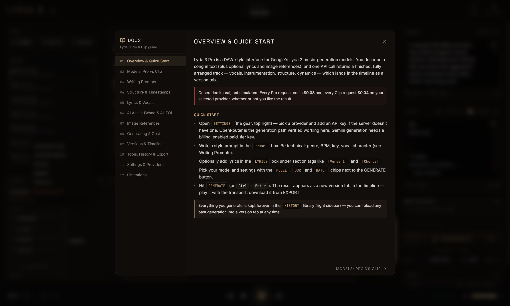

<div align="center">

```text
██╗      ██╗   ██╗ ██████╗  ██╗  █████╗    ██████╗
██║      ╚██╗ ██╔╝ ██╔══██╗ ██║ ██╔══██╗   ╚════██╗
██║       ╚████╔╝  ██████╔╝ ██║ ███████║    █████╔╝
██║        ╚██╔╝   ██╔══██╗ ██║ ██╔══██║    ╚═══██╗
███████╗    ██║    ██║  ██║ ██║ ██║  ██║   ██████╔╝
╚══════╝    ╚═╝    ╚═╝  ╚═╝ ╚═╝ ╚═╝  ╚═╝   ╚═════╝

▁▂▃▅▇█▇▅▃▂▁▂▄▆█▆▄▂▁▃▅▇▅▃▁▂▃▅▇█▇▅▃▂▁▂▄▆█▆▄▂▁▃▅▇▅▃▁

     P R O   ·   A I   M U S I C   S T U D I O
```

**A DAW-style studio for Google's Lyria 3 music models.**
Describe a song, get a finished, fully arranged track: vocals, instruments, structure, dynamics.


[Features](#features) · [Quick Start](#quick-start) · [User Guide](docs/USER_GUIDE.md) · [Providers](#providers) · [Configuration](#configuration) · [Architecture](#architecture) · [API](#api)

</div>

---


> **Generation is real, not simulated.** Every Lyria 3 Pro request costs **$0.08** and every Clip **$0.04** on your provider, whether or not you keep the result. For free local development, run in [mock mode](#mock-mode-free).

## Features

| | |
|---|---|
| **Real Lyria 3 generation** | Lyria 3 Pro (full songs, target length up to ~3:00) and Lyria 3 Clip (~0:30) through **OpenRouter** or **Gemini**. You pick the provider; see [Providers](#providers) for what each one requires of your account. |
| **Prompt + lyrics editors** | Separate style prompt and lyrics editors, each with undo/redo over typing and AI edits alike, section-tag lyrics, 8 vocal languages, and a VOCALS (instrumental) toggle. |
| **AI assist** | The wand rewrites a selection or the whole box to your instruction. Two independent **AUTO** toggles (both off by default) expand your prompt and write matching lyrics before a generation, writing the result into the editor first so you see what you are paying for. |
| **Image references** | Drop up to 10 images as creative and emotional context for the arrangement. No audio input — the API does not accept it. |
| **Versions & timeline** | Every generation becomes a version tab. A new project starts with no tabs; the first real take is V1 and keeps that number across reloads. The MASTER lane is drawn from the real decoded audio. Zoom, scrub, compare. |
| **Audio analysis** | One click (never automatic, always a paid call) detects genre, mood, energy, BPM, key, instrumentation and **section boundaries** from the actual audio, then maps them onto the timeline and caches the result on disk. |
| **Section inspector** | Click a detected section to REGENERATE / EXTEND / RESTYLE / REPLACE / LOCK it through timed prompt directives that you can read and undo in the prompt box. |
| **Persistent library** | Every generation is saved to disk with a JSON manifest. HISTORY reloads any past take, with or without the settings that made it, and never deletes audio. |
| **Projects** | Named projects that save your prompt, lyrics, settings and version list on their own. Archive instead of delete. |
| **Transport** | Play / stop / ±10 s seek, real elapsed time and duration, live L/R meters from a WebAudio analyser. |
| **Export** | Downloads the exact file the provider produced, with no conversion or re-encoding, named after the track title. Disabled when the active version has no audio. |
| **Built-in docs** | A 12-chapter guide inside the app covering models, prompting, structure, cost and limits. |
| **Mock mode** | `LYRIA_MOCK=1` runs the whole pipeline against locally synthesized audio. $0, no keys needed. |

## Quick Start

**Requirements:** [Node.js](https://nodejs.org) **20+** (Vite 6 accepts `^18`, `^20` or `>=22`) and an API key from [OpenRouter](https://openrouter.ai/keys) **or** [Google AI Studio](https://aistudio.google.com/apikey) (Gemini — generation needs billing enabled on the key; see [Providers](#providers) first).

```bash
git clone https://github.com/StarskreamEXE/lyria-3-pro.git
cd lyria-3-pro
npm install
cp .env.example .env.local     # then add OPENROUTER_API_KEY and/or GEMINI_API_KEY
npm run dev
```

Open **http://localhost:3001**.

**Windows one-click:** run `install.bat` once — it checks for Node, installs the dependencies and creates `.env.local` from `.env.example` — then `launch.bat`, which re-checks both, starts the server and opens your browser.

> You can skip the `.env.local` key entirely and paste a key into **Settings** (gear icon, top right) instead. It's stored in your browser only.

### Mock mode (free)

Run the full app with no API key and no charges. Generation returns a locally synthesized WAV, and the AI helpers and analysis return clearly labeled mock results.

```bash
# macOS / Linux
LYRIA_MOCK=1 npm run dev

# Windows PowerShell
$env:LYRIA_MOCK="1"; npm run dev
```

Mock results show a **MOCK** badge on their version tab and in History.

## Providers

Both providers are wired for generation, the AI text helpers and analysis, and both are priced the same per track. What they ask of your account differs:

- **OpenRouter** needs credits on the account. It refuses any audio request while the balance is under **$0.50**, and refuses before generating, so a refused request is not billed. Both Pro and Clip return **MP3**, stereo 44.1 kHz. Settings shows your live balance and roughly how many tracks it covers when the key is allowed to read OpenRouter's credits endpoint (a plain inference key may not be; the balance line is then simply absent, and generation still works).
- **Gemini** needs a **billing-enabled** Google API key. Google's free tier grants **zero Lyria requests per day**, so a free-tier key fails the generation request immediately with `429 Rate limit exceeded for model lyria-3-clip (limit: 0 requests per day on Free Tier)`. That is a quota wall rather than a transient rate limit — retrying never clears it. Enable billing on the key, or use OpenRouter. The Gemini text helpers and analysis are unaffected by that quota.

Google documents a WAV response path for Lyria 3 Pro (`response_format: { type: "audio" }`), and the app asks for it on the Pro path. It never trusts the answer: the audio format is detected from the returned bytes, and that detected format is what lands on disk, in the manifest and in EXPORT.

## Tour

<table>
<tr>
<td width="50%"></td>
<td width="50%">

**Compose.** Write a technical style prompt (genre, BPM, key, vocal character), add lyrics under `[Verse]` / `[Chorus]` tags, drop reference images, name the track, and choose **MODEL**, **DUR** and **BATCH**. The cost readout under GENERATE shows the exact spend before you click.

</td>
</tr>
</table>


**Direct.** Analysis splits the real audio into sections on the timeline. Select one to open the inspector and queue a directed regeneration.

<table>
<tr>
<td width="50%"></td>
<td width="50%"></td>
</tr>
<tr>
<td><b>Library.</b> Every take ever generated. Right-click to load, load with settings, rename, analyze, download, or hide the row from the list.</td>
<td><b>Projects.</b> Switch between projects or start a new one. Each saves its own state automatically.</td>
</tr>
</table>

<table>
<tr>
<td width="50%"></td>
<td width="50%"></td>
</tr>
<tr>
<td><b>Docs.</b> A full prompting and model guide, inside the app.</td>
<td><b>Settings.</b> Choose Gemini or OpenRouter and manage keys. The status line reports only whether a key is saved, never any key material.</td>
</tr>
</table>

> These screenshots were captured before the latest interface pass. The EXPORT panel no longer offers a WAV/MP3 choice — it reports the real format of the file the provider produced.

## User Guide

The **[full User Guide](docs/USER_GUIDE.md)** covers every panel, control and workflow: writing prompts, structuring songs with timestamps, AI assist, versions, analysis, projects, export, costs, shortcuts and troubleshooting.

## Configuration

All variables go in `.env.local` (git-ignored). Real environment variables override the file.

| Variable | Default | Purpose |
|---|---|---|
| `GEMINI_API_KEY` | — | Google Gemini API key (generation, AI assist, analysis). |
| `OPENROUTER_API_KEY` | — | OpenRouter API key (same features, via OpenRouter). |
| `AI_PROVIDER` | `gemini` | Server-side default provider: `gemini` or `openrouter`. The in-app Settings choice overrides it per browser. |
| `OPENROUTER_TEXT_MODEL` | `google/gemini-3.5-flash` | Text model for the wand / AUTO helpers on OpenRouter. |
| `OPENROUTER_ANALYZE_MODEL` | `google/gemini-3.5-flash` | Model used for audio analysis on OpenRouter. |
| `LYRIA_MOCK` | off | `1` = mock mode: no provider calls, no cost. |
| `PORT` | `3001` | Server port. |
| `DISABLE_HMR` | off | `true` disables Vite hot-reload and file watching. |

Keys entered in **Settings** are kept in the browser's `localStorage` and sent as request headers. They take precedence over the server's keys. The server never returns key material to the browser, only whether a key is configured.

## Architecture

```text
┌──────────────────────────── Browser (React 19 + Tailwind v4) ────────────────────────────┐
│  TopBar ── projects · docs · settings                                                    │
│  left column  (SidebarRight.tsx) ── tools · history                                      │
│  center       (CenterPanel.tsx)  ── analysis · visualizer · versions · timeline          │
│  right rail   (SidebarLeft.tsx + ExportPanel.tsx) ── prompt · lyrics · images · generate │
│  BottomBar ── transport · meters (WebAudio analyser)                                     │
└───────────────────────────────────────────┬──────────────────────────────────────────────┘
                                            │  /api/*   (x-ai-provider, optional key headers)
┌───────────────────────────────────────────▼──────────────────────────────────────────────┐
│  Express server (server.ts)  ── Vite middleware in dev · static dist/ in prod            │
│  server/lyria.ts     prompt assembly · provider calls · audio parsing · analysis         │
│  server/projects.ts  project persistence                                                 │
└──────────────┬──────────────────────────────┬──────────────────────────────┬─────────────┘
               ▼                              ▼                              ▼
     Gemini Interactions API       OpenRouter chat completions      generations/  projects/
     (lyria-3-pro / clip)          (SSE audio stream)               audio + JSON manifests
```

```text
src/
  App.tsx                 layout shell
  components/             TopBar, SidebarLeft, CenterPanel, SidebarRight, BottomBar,
                          Waveform, ExportPanel, SettingsModal, DocsModal, ContextMenu
  lib/                    lyriaClient (API client), player (audio + meters),
                          projectStore, sections, waveformData, lyricsText
server/
  lyria.ts                generation, parsing, analysis, mock mode
  projects.ts             project library
server.ts                 Express entry point + routes
docs/                     user guide, Lyria model/prompting/API guides, deep dives
public/                   orb visualizer (p5.js)
```

Generated audio lands in `generations/` and projects in `projects/`. Both are local data and git-ignored.

## API

| Method | Route | Description |
|---|---|---|
| `POST` | `/api/lyria/generate` | Generate a track (Pro or Clip). Persists audio + manifest. Paid. |
| `GET` | `/api/generations` | List every saved generation, newest first. |
| `PUT` | `/api/generations/:id` | Rename a generation (manifest title + embedded audio tag). |
| `POST` | `/api/ai/analyze` | Analyze a generation's audio (genre, mood, BPM, key, sections). Paid, cached in the manifest. |
| `POST` | `/api/ai/modify` | Rewrite prompt or lyrics text per an instruction (whole or selection). Paid. |
| `POST` | `/api/ai/enhance-prompt` | Expand a short idea into a detailed generation prompt. Paid. |
| `GET` `POST` | `/api/projects` | List / create projects. |
| `PUT` | `/api/projects/:id` | Update a project. |
| `POST` | `/api/projects/:id/archive` | Archive a project (moved to `projects/archived/`, never deleted). |
| `GET` | `/api/openrouter/credits` | Live OpenRouter balance, when the key can read it. |
| `GET` | `/api/settings/status` | Which keys the server has (booleans only) and the default provider. |

Generated audio is served as static files under `/generations`, with byte-range requests supported for seeking.

## Scripts

| Command | What it does |
|---|---|
| `npm run dev` | Dev server: Express + Vite middleware, port 3001. |
| `npm run build` | Build the SPA and bundle the server to `dist/server.cjs`. |
| `npm run start` | Run the production bundle. |
| `npm run lint` | Type-check (`tsc --noEmit`). |
| `npm test` | Run the Vitest suite (218 tests). |

## Cost & limits

| Model | Length | Output | Price (Gemini or OpenRouter) |
|---|---|---|---|
| Lyria 3 Pro | target up to ~3:00, not guaranteed | whatever the provider returns, detected from the bytes — **MP3** on OpenRouter, stereo 44.1 kHz; Google documents a WAV path for Pro | **$0.08** / request |
| Lyria 3 Clip | ~0:30, fixed by the model | **MP3**, stereo 44.1 kHz | **$0.04** / request |

- **BATCH ×N = N full-price requests.** Lyria has no multi-sample option.
- **Analysis and the AI text helpers are extra paid calls.** They are cheap (fractions of a cent to a few cents), not free.
- **DUR is a target, not a contract.** The API has no duration parameter, so the value is written into the prompt as an explicit running time and nothing enforces it. Tracks can come back noticeably longer or shorter than asked.
- **Single-turn only.** A generated track can't be edited in place, so every "edit" is a new generation and a new version.
- **No audio input, stems, MIDI or seeds.** Output is one mixed stereo master, and the same prompt gives different results each time.
- All output carries Google's SynthID watermark and C2PA metadata, which this app preserves when it writes title tags into the file.
- OpenRouter requires an account balance of at least **$0.50** for any audio request; below that it refuses the request before generating, and the refused request is not billed.

## Further reading

- [User Guide](docs/USER_GUIDE.md): how to use every part of the app
- [Documentation index](docs/README.md): Lyria models, the prompting framework, API integration, the UI/API map, RealTime and roadmap
- [Lyria 3 Pro technical deep dive](docs/Lyria_3_Pro_Technical_Deep_Dive.md)

<div align="center">

<sub>▁▂▃▅▇█▇▅▃▂▁ Built with React, Tailwind, Express and Google Lyria 3 ▁▂▃▅▇█▇▅▃▂▁</sub>

</div>
