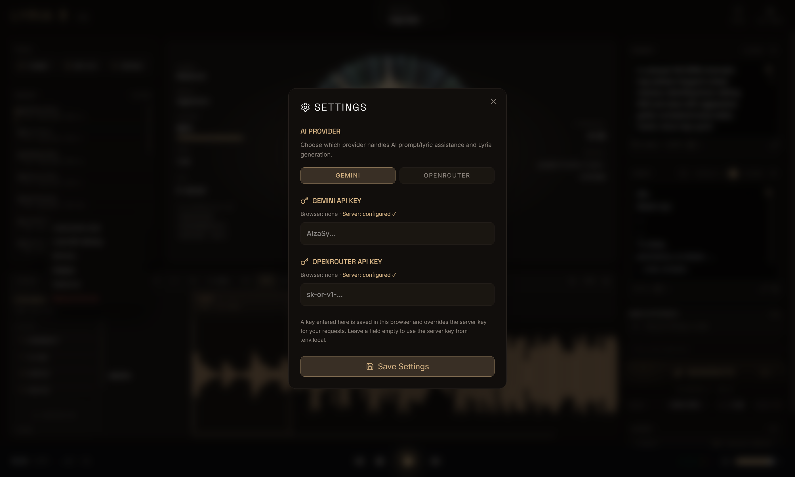
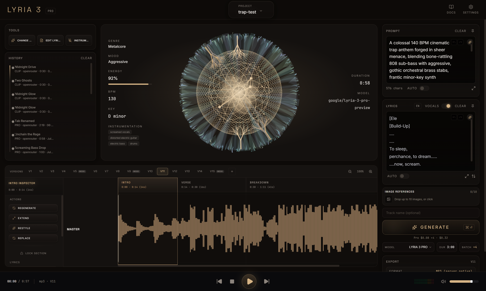
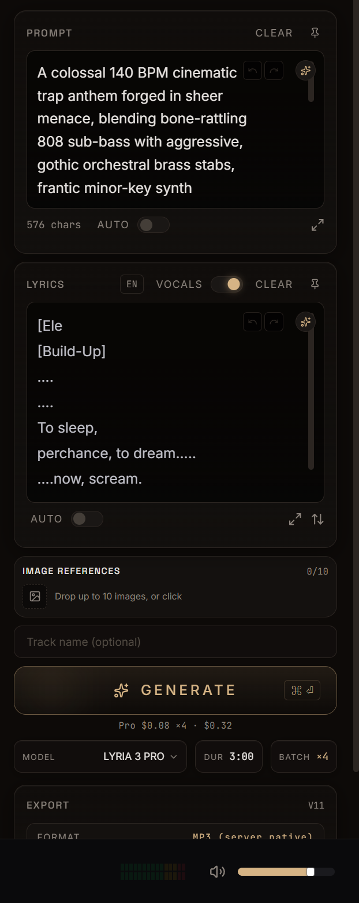
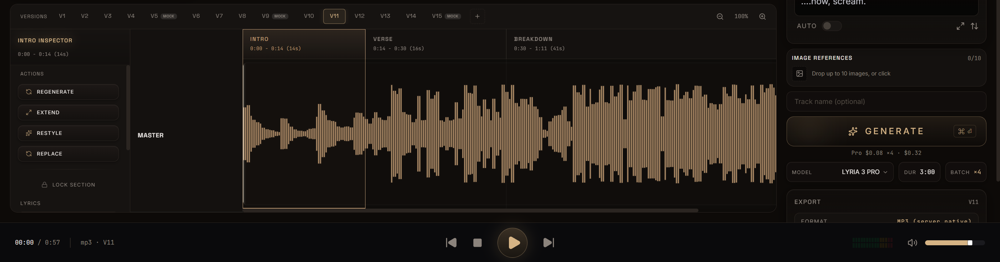
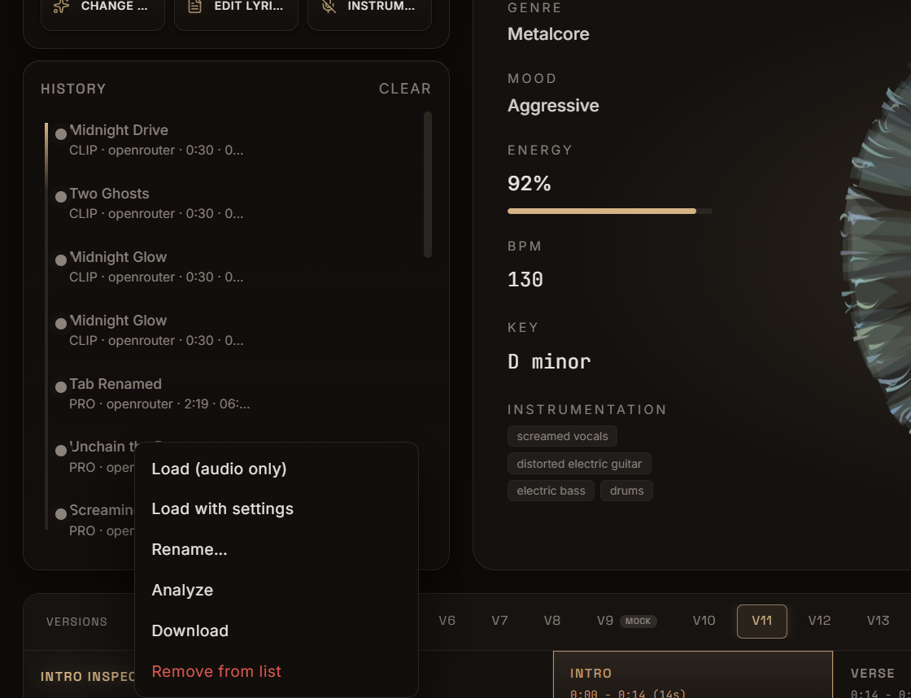
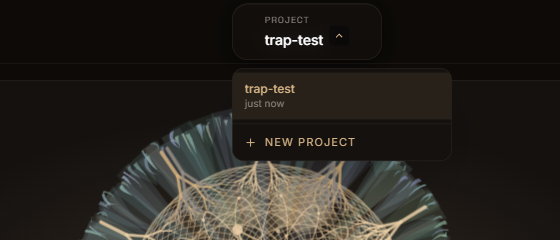

# Lyria 3 Pro: User Guide

```text
   ╔═══════════════════════════════════════════════════════════════╗
   ║   L Y R I A   3   P R O   ·   U S E R   G U I D E             ║
   ║   ▁▂▃▅▇█▇▅▃▂▁▂▄▆█▆▄▂▁▃▅▇▅▃▁▂▃▅▇█▇▅▃▂▁▂▄▆█▆▄▂▁▃▅▇▅▃▁▂▃▅▇█▇▅▃   ║
   ╚═══════════════════════════════════════════════════════════════╝
```

This guide explains how to use every part of Lyria 3 Pro, from first launch to exporting a finished track. For installation and configuration, see the [README](../README.md).

> **Real money.** Unless the server runs in mock mode, every Lyria 3 Pro generation costs **$0.08** and every Clip **$0.04** on your provider, whether or not you keep the result. Analysis and the AI text helpers (wand, AUTO) are separate paid calls — cheap, but not free.

## Contents

1. [First launch](#1-first-launch)
2. [The workspace at a glance](#2-the-workspace-at-a-glance)
3. [Your first track in five steps](#3-your-first-track-in-five-steps)
4. [Writing the prompt](#4-writing-the-prompt)
5. [Song structure and timestamps](#5-song-structure-and-timestamps)
6. [Lyrics and vocals](#6-lyrics-and-vocals)
7. [AI assist: the wand and AUTO](#7-ai-assist-the-wand-and-auto)
8. [Image references](#8-image-references)
9. [Generating: model, duration, batch, cost](#9-generating-model-duration-batch-cost)
10. [Versions and the timeline](#10-versions-and-the-timeline)
11. [Analysis and the section inspector](#11-analysis-and-the-section-inspector)
12. [Tools](#12-tools)
13. [History: the permanent library](#13-history-the-permanent-library)
14. [Projects](#14-projects)
15. [Playback](#15-playback)
16. [Export](#16-export)
17. [Settings and providers](#17-settings-and-providers)
18. [Mock mode](#18-mock-mode)
19. [Keyboard and mouse reference](#19-keyboard-and-mouse-reference)
20. [What Lyria 3 cannot do](#20-what-lyria-3-cannot-do)
21. [Troubleshooting](#21-troubleshooting)
22. [Where your files live](#22-where-your-files-live)

---

## 1. First launch

1. Start the app (`npm run dev`, or `launch.bat` on Windows) and open **http://localhost:3001**.
2. Click **SETTINGS** (gear, top right).
3. Pick a provider: **GEMINI** or **OPENROUTER**. With no stored choice yet, the buttons follow the server's own default (`AI_PROVIDER`). Each one has an account requirement before generation will run — OpenRouter needs credits, Gemini needs billing enabled on the key. See [section 17](#17-settings-and-providers).
4. Each provider has an ordered **key list**. A status line above it reports counts only, for example `Browser: none · Server: 1 key`. If the server already has a key, you can close Settings. If not, paste your key into the field at the bottom of the list, press **Add**, then click **Save Settings** — until you do, the line warns `Unsaved changes — press Save Settings`.
5. You can add more than one key per provider. They are tried top-down, and a key that gets rejected is skipped for the next one. See [section 17](#17-settings-and-providers).
6. Click **DOCS** (book icon, top right) any time for the built-in 12-chapter reference.



## 2. The workspace at a glance



```text
┌─ TOP BAR ────────────────────────────────────────────────────────────────────────┐
│  LYRIA 3 PRO          [ PROJECT name  v ]                        DOCS  SETTINGS  │
├──────────────┬──────────────────────────────────────────────┬────────────────────┤
│  TOOLS       │  ANALYSIS          VISUALIZER         INFO   │  PROMPT            │
│              │  genre · mood      (orb reacts to            │  LYRICS            │
│  HISTORY     │  energy · bpm      activity)       duration  │  IMAGE REFERENCES  │
│  (library)   │  key · instruments                 model     │  Track name        │
│              ├──────────────────────────────────────────────┤  GENERATE          │
│              │  VERSIONS  V1 V2 V3 ...  +          zoom     │  MODEL DUR BATCH   │
│              │  SECTION     │  INTRO | VERSE | CHORUS ...   │                    │
│              │  INSPECTOR   │  MASTER waveform              │  EXPORT            │
├──────────────┴──────────────────────────────────────────────┴────────────────────┤
│  00:05 / 0:57  mp3 · V11        |<<   []   >   >>|             meters   volume   │
└──────────────────────────────────────────────────────────────────────────────────┘
```

| Area | What it is for |
|---|---|
| **Top bar** | Current project (click the name to rename, the arrow to open the project library), DOCS, SETTINGS. |
| **Left column** | TOOLS (one-click actions) and HISTORY (every track you have ever generated). |
| **Center, top** | Analysis readout for the active version, the visualizer orb, and the active version's own measured duration and model id. |
| **Center, bottom** | Version tabs, the timeline with detected sections, the MASTER waveform, and the section inspector. |
| **Right rail** | Everything that shapes the next generation: prompt, lyrics, images, name, model, duration, batch, GENERATE, and EXPORT. |
| **Bottom bar** | Transport, position and duration, format and version, level meters, volume. |

Both editors start empty on a brand-new project, and a first-run project is called **Untitled Project**. Nothing is pre-filled with sample text.

## 3. Your first track in five steps

1. **Prompt.** In the PROMPT box, describe the song technically:
   `Dark synthwave, 118 BPM, A minor, driving analog bass, gated reverb drums, breathy female alto vocal, wide cinematic chorus.`
2. **Lyrics (optional).** In the LYRICS box, write words under section tags:
   ```text
   [Verse 1]
   Neon on the water, engines in the rain
   [Chorus]
   We run until the city forgets our names
   ```
   To make an instrumental, switch **VOCALS** off.
3. **Settings.** Choose **MODEL** (Clip is cheaper for testing), **DUR** and **BATCH**. The line under GENERATE shows the exact cost.
4. **Generate.** Click **GENERATE** or press **Ctrl+Enter** (**Cmd+Enter** on macOS). The orb animates while the request runs.
5. **Listen and keep.** The result appears as a new version tab and starts playing. If you like it, download it from **EXPORT**. It is also saved in HISTORY automatically.

## 4. Writing the prompt

The prompt is the **only** control Lyria 3 has. There are no tempo, key, structure or vocal parameters in the API, so every musical decision has to be written into the text.

**What a prompt can control:** genre and blends, BPM, key and scale, time signature, instrumentation, vocal range, character, texture and delivery, lyric language, instrumental-only, approximate duration, section order, timestamped arrangement, mood, energy curve, dynamics, production style, stereo width, and arrangement density.

**Be specific.** `132 BPM, D minor, low male baritone` beats `dark and cool` every time.

**The recommended shape** separates direction, exclusions and structure:

```text
Create a 2 minute 30 second industrial metalcore and electronic track.

Technical direction:
- 150 BPM
- D minor
- 4/4
- Low male baritone lead vocal
- Down-tuned rhythm guitars, distorted electronic bass
- Dark, aggressive production; wide choruses, narrow intimate verses

Avoid:
- Falsetto
- Orchestral strings
- Long ambient introduction
```

**Exclusions work.** Lyria 3 has no negative-prompt parameter. An explicit `Avoid:` list is the officially recommended substitute.

**Prompt box controls**

| Control | Action |
|---|---|
| Undo / Redo arrows | Step through the prompt's edit history. Typing counts too: a burst of keystrokes lands as one undo step, so undo after an AI rewrite gives back exactly what you had typed, and redo returns the rewrite. CLEAR and appended section directives are steps of their own. |
| Wand | AI rewrite (see [section 7](#7-ai-assist-the-wand-and-auto)). |
| AUTO | AI-enhance the prompt before every generation. Off by default. |
| Expand arrow | Opens a larger editing area. |
| Pin | Keeps the expanded editor open. |
| CLEAR | Empties the box (undoable). |
| Character count | Current prompt length. |

## 5. Song structure and timestamps

**Section tags** tell the model the arrangement:
`[Intro]` `[Verse 1]` `[Pre-Chorus]` `[Chorus]` `[Verse 2]` `[Bridge]` `[Breakdown]` `[Final Chorus]` `[Outro]`

Custom labels also work if you describe their musical role. The model shapes each section to its job: choruses hit harder, bridges bring contrast.

**Timestamp prompting** assigns events to times. It's ideal for genre switches and scoring to picture:

```text
[00:00] Begin immediately with a massive gospel choir singing an uplifting harmony.
[00:15] A heavy modern hip-hop beat and a deep 808 bassline drop in.
[00:30] A male lead begins rapping a confident verse, choir punctuating his lines.
[01:50] The beat strips back to a gentle Hammond B3 organ; quiet emotional bridge.
[02:10] Full beat and choir return at maximum energy, ending on a sustained chord at [03:00].
```

**Energy-curve language** also works well:

```text
Begin sparse and intimate. Increase rhythmic density through the pre-chorus.
Open into a wide full-spectrum chorus. Collapse into a half-time breakdown.
Return with the largest final chorus.
```

> Timestamps and durations **guide** the model. They are not sample-exact, and nothing enforces them. Expect the shape, not the exact second.

## 6. Lyrics and vocals



- **LYRICS box.** Words under section tags. At generation time it is merged into the final request for you.
- **Language chip** (`EN` next to the LYRICS header). Click it to cycle through the 8 supported vocal languages: English, German, Spanish, French, Hindi, Japanese, Korean, Portuguese.
- **VOCALS toggle.** On: the lyrics are sung. Off: the track generates as an **instrumental**. Your lyrics are not sent, an "Instrumental only — no vocals." directive is added to the outgoing request, and your prompt box is left unchanged. The setting is remembered between sessions.
- **Reorder sections** (up/down arrow button in the lyrics footer). Moves whole tagged sections up or down, and the move is undoable. Untagged text before the first tag stays pinned at the top. The button is disabled until the lyrics contain at least one `[Tag]`.
- **Undo / redo, wand, AUTO, expand, pin, CLEAR** work the same way as on the prompt box.

**Directing the voice.** Describe four things in the prompt:

| Angle | Examples |
|---|---|
| Range | commanding baritone, clear high soprano |
| Texture | gravelly, soulful, breathy |
| Delivery | fast-paced, laid-back groove, quieter as the track progresses |
| Layering | stacked harmonies, call-and-response, choir |

> Lyric adherence is not guaranteed. The model usually follows your words closely but may compress, repeat or alter lines to fit the music.

## 7. AI assist: the wand and AUTO

Both helpers use your selected provider's text model. They are paid text calls, but very cheap.

**The wand (refine).** Click the wand on the PROMPT or LYRICS box and type an instruction, for example `make the chorus darker` or `add a key change before the final chorus`, then press Enter.
- With text **highlighted**, only the selection is rewritten.
- With **nothing selected**, the whole box is rewritten.
- Every rewrite goes into undo history, so you can always step back.
- If the call fails you get exactly one error dialog, carrying the real reason. The box is left untouched.

**AUTO (prompt).** When on, your prompt is expanded into a detailed generation prompt **before each generation**. The enhanced text replaces the box contents first, so you always see what was sent. If enhancement fails, the generation is **cancelled** and you are not charged. Retry, or switch AUTO off.

**AUTO (lyrics).** When on, lyrics are written or updated to match your prompt (including an AUTO-enhanced one) before generation. The new lyrics appear in the box before the music request goes out. It is skipped when VOCALS is off.

AUTO is off by default on both boxes.

## 8. Image references

Drag images onto **IMAGE REFERENCES**, or click it, to attach up to **10** images. They act as creative and emotional context and are never treated as audio. Tell the model how to read them:

```text
Interpret: color palette as harmonic mood, visual density as arrangement density,
lighting as brightness and timbre, perceived movement as rhythmic intensity.
```

> There is no audio input of any kind. Lyria 3 cannot listen to, continue or cover an uploaded song.

## 9. Generating: model, duration, batch, cost

| Chip | Options | Notes |
|---|---|---|
| **MODEL** | Lyria 3 Pro, Lyria 3 Clip | The only two models this app generates with. Pro: full songs, target length up to ~3:00. Clip: ~0:30, fixed by the model. |
| **DUR** | 1:00, 2:00, 3:00 | An **approximate target** only. The API has no duration parameter, so the value is written into the prompt as an explicit total running time and the model treats it as a hint — a track can come back noticeably longer or shorter than asked. Disabled for Clip, which is always ~0:30. |
| **BATCH** | ×1, ×2, ×4 | Number of versions per click. Each is a separate full-price request. |

- **Track name** (field above GENERATE) is optional and names the next generation. Batches add `(2)`, `(3)` and so on. A name you give is never replaced later — not by a rename elsewhere, and not by the title the analysis invents.
- **Cost readout** under GENERATE shows the real spend for the current settings, for example `Pro $0.08 ×4 · $0.32`. With OpenRouter active it also appends your balance and roughly how many more tracks it covers at the selected model's price, for example ` · bal $5.00 (≈62 left)`.
- **GENERATE** or **Ctrl/Cmd+Enter** fires the request(s). The final prompt is assembled on the server from your prompt, duration target, section directives, lyrics and language.

| Model | Price per request | Output format |
|---|---|---|
| Lyria 3 Pro | $0.08 | whatever the provider returns — **MP3** on OpenRouter, stereo 44.1 kHz; Google documents a WAV path for Pro |
| Lyria 3 Clip | $0.04 | **MP3**, stereo 44.1 kHz |

The app never assumes a container: it detects the format from the returned bytes, and that is what is written to disk, recorded in the manifest and offered by EXPORT.

> There is no seed. The same prompt gives different results every time, which is why BATCH exists. Generate several, keep the best.

**Workflow tip:** use **Clip** to iterate on a style cheaply, then switch to **Pro** once the prompt is right.

## 10. Versions and the timeline



- A brand-new project has **no version tabs at all** — the timeline says so plainly instead of showing empty placeholders. Your first generation becomes **V1**, and reopening the project does not renumber anything.
- Every completed generation becomes a **version tab** (`V1`, `V2`, ...). A version is never edited, only superseded.
- Click a tab to make it active. The transport, analysis panel, timeline and EXPORT all follow the active version.
- **Right-click a tab** for: Load settings from this version, Rename..., Analyze, Export. Rename happens inline in the tab itself (Enter saves, Escape cancels) — there is no browser popup.
- **Right-click the waveform** for: Seek here, Analyze this version, Export this version. Opening this menu does not move the playhead; only the explicit "Seek here" item does.
- **Left-click or drag the waveform** to scrub to a position.
- **`+` tab** fires a fresh generation with your current settings (paid).
- A **MOCK** badge marks simulated audio from mock mode.
- The **MASTER** lane is drawn from the version's actual decoded audio. A version whose audio file cannot be read shows a flat line, and EXPORT stays disabled for it.
- **Zoom** with the magnifier buttons at the top right of the timeline, or the mouse wheel over the track area. Scroll sideways to move along the track.

**Why "edit" means "regenerate."** Lyria 3 is single-turn. The API cannot modify a finished track, replace part of it, or refine it with follow-up prompts. Every edit action in this app is therefore a new prompt, a new full generation and a new version, at full price.

## 11. Analysis and the section inspector

**Analyze.** Analysis never runs on its own. Click **ANALYZE** in the center panel (or use Analyze from a tab, waveform or History right-click menu) and the generation's actual audio is sent to a text model, which detects:

- genre, mood and energy (0 to 100%)
- BPM and key
- instrumentation
- **section boundaries** (intro, verse, chorus, breakdown, ...) with timestamps

It is a **paid call**, so it only ever happens when you ask for it. The label under the button names the provider the call will really route to — your Settings choice, or the server's default. Results are cached on disk in the generation's manifest, so each generation is analyzed once, for a few cents at most. The detected sections are drawn across the top of the timeline; BPM or key the model could not identify are left out rather than invented.

**Section inspector.** Click a detected section on the timeline. The inspector on the left shows its time range and these actions:

| Action | What it does |
|---|---|
| **REGENERATE** | Redo this time range with the same intent. |
| **EXTEND** | Lengthen this section. |
| **RESTYLE** | Change this section's style. |
| **REPLACE** | Swap this section for something new. |
| **LOCK SECTION** | Keep this time range as it is while the rest changes. Pressing it again (UNLOCK) removes exactly the line it added. |

Each action writes a timed directive into your prompt, where you can read and undo it, and queues a new **paid** generation. Pressing the same action on the same section again replaces its own previous line instead of stacking another copy. The untouched parts are re-performed, not copied, so expect a close sibling rather than a surgical edit.

Under the actions, **LYRICS** shows the words actually sung in this generation, as returned by the provider, with the provider's own structural and timing markup (`[[A0]]`, `[:]`, `[2.0:6.1]`) stripped out.

The **DURATION** and **MODEL** readouts on the right of the center panel are the active version's own recorded values — the measured length of its audio file and the model id from its manifest. When a version records neither, they show a dash instead of guessing.

## 12. Tools

| Tool | What it does |
|---|---|
| **CHANGE STYLE** | Opens a small input for a style instruction (for example `slower, lo-fi, 90bpm`). Press APPLY or Enter and the line is appended to your PROMPT box — visible and undoable there — then a new version is generated from it (paid). Nothing is charged until you submit an instruction. |
| **EDIT LYRICS** | Opens and pins the lyrics editor. |
| **INSTRUMENTAL** | Generates one instrumental version (paid): no lyrics are sent and the instrumental directive goes into that single request only. Your prompt box and your VOCALS toggle are left exactly as they were. |

## 13. History: the permanent library



HISTORY lists **every generation saved on disk**, newest first, with model, provider, duration and date.

- **Click** an entry to load it as a version tab.
- **Right-click** for:
  - **Load (audio only).** Load the track without touching your current prompt and settings.
  - **Load with settings.** Also restore the prompt, lyrics and the chips that produced it — model, and (for takes made since those fields were recorded) language, duration target and batch size. Anything the manifest does not record is left alone rather than reset to a default.
  - **Rename...** — inline, in the row.
  - **Analyze.**
  - **Download.**
  - **Remove from list.**
- **CLEAR** hides every listed row.

> Remove and CLEAR only tidy the list, and the hidden rows stay hidden after a reload — this is a per-browser view preference. **Audio files on disk are never deleted.** When anything is hidden, a **SHOW N HIDDEN** button appears next to CLEAR and brings every row back.

## 14. Projects



A project holds your working state: prompt, lyrics, settings (model, duration, batch, language) and the list of versions it has generated. It saves automatically as you work.

- **Rename:** click the project name in the top bar, type, press Enter (clicking away also saves).
- **Switch or create:** click the arrow next to the name to open the library. Pick a project, or choose **NEW PROJECT**.
- **Archive:** use the archive button on a project in the library. The file moves to `projects/archived/` and is never deleted.

## 15. Playback

| Control | Action |
|---|---|
| Play / Pause | Play the active version. A fresh generation starts playing on arrival. |
| Stop | Stop and return to the start. |
| Rewind / Fast-forward | Jump 10 seconds back or forward. |
| Position | Elapsed time / total duration of the active version. |
| Format · version | For example `mp3 · V11`. The file currently loaded; a dash when nothing is loaded. |
| Meters | Live left/right output level. |
| Volume and mute | Playback volume only. Does not affect exported files. Mute remembers the level you were at and restores it on unmute, and the icon shows the muted state. |

## 16. Export

The EXPORT panel (bottom of the right rail) shows which version it applies to and the **real format of the file the server produced** — read from the bytes, not chosen by you. Clicking it downloads **that exact file**, with no conversion or re-encoding. The file is named after the track's title (sanitized for your filesystem), falling back to the generation id. With no audio on the active version the panel reads `NO AUDIO YET` and the button is disabled. You can also export from a version tab's or History entry's right-click menu.

## 17. Settings and providers

- **AI PROVIDER** (`GEMINI` or `OPENROUTER`) routes everything: generation, the wand, AUTO and analysis. Generation prices are identical on both. Until you save a choice, the selector follows the server's own default.
- **What each provider requires.** Gemini generation needs a **billing-enabled** Google API key: Google's free tier grants zero Lyria requests per day, so a free-tier key fails immediately with `429 Rate limit exceeded for model lyria-3-clip (limit: 0 requests per day on Free Tier)`. That is a quota wall, not a transient rate limit, so retrying never clears it. OpenRouter needs credits on the account and refuses audio requests under a $0.50 balance; it returns MP3 for both Pro and Clip. Mock mode needs neither and costs nothing.
- **API keys** entered here are stored **in this browser only**. Each provider has its own **ordered list**, so you can keep several keys and let the app work down them.
  - **Add** a key by typing it into the field below the list (with an optional short label, for example `personal` or `work`) and pressing **Add** or Enter. Press **Save Settings** to store the list.
  - **Reorder** with the up and down arrows on a row. **Position 1 is tried first.**
  - **Remove** with the bin icon on a row.
  - A key's value is **never shown back to you**, not even a fragment. A row shows its position number, its label (or `Key N` while unlabeled) and a status: `Saved`, `New`, `Moved` or `Renamed`.
  - The status line above the list reports counts only, for example `Browser: 2 keys · Server: 1 key`, plus `Unsaved changes — press Save Settings` while an edit is only typed.
  - Store no keys for a provider to use the server's keys from `.env.local` instead.
- **How the fallback works.** Browser keys are tried before server keys, and within each group the keys are tried in the stored order. A key rejected for a reason that belongs to the key — invalid or revoked, out of credit, or a quota that grants zero requests (Google's free tier for Lyria is exactly that) — is skipped and the next key is tried. A **request-level** error such as a malformed request or a provider outage stops there and is not retried on another key, so nothing is billed twice.
- **Server-side keys.** `.env.local` accepts a list in one variable, `GEMINI_API_KEY=key1,key2` (commas or newlines), or numbered variables `GEMINI_API_KEY_2`, `GEMINI_API_KEY_3`, and so on. `OPENROUTER_API_KEY` works the same way. Numbered keys follow the list in the base variable.
- **What you see afterwards.** When a request only succeeded after falling back, the cost line under GENERATE says so, for example `Used key 2 after key 1 was rejected`. If every key fails, the error names each rejected key **by position and reason** — `2 keys were rejected: key 1 (429 quota), key 2 (401 invalid)` — never by value.
- **OpenRouter balance.** With OpenRouter configured, Settings shows the live balance of your **first** stored OpenRouter key and how many songs or clips it covers, for example `Balance: $5.00 · ≈62 songs / 125 clips`. OpenRouter requires a balance of at least **$0.50** for any audio request and refuses below that before generating, so nothing is charged when it refuses. If that key is not allowed to read OpenRouter's credits endpoint, no balance line is shown — generation still works.

## 18. Mock mode

When the server runs with `LYRIA_MOCK=1`:

- GENERATE returns a short locally synthesized WAV instead of calling a provider.
- The wand and AUTO return clearly labeled mock text (`[mock modify: ...]`, `[mock enhance] ...`).
- Analyze returns a labeled mock analysis and does not cache it, so a real analysis is never overwritten by a mock one.
- No API key is needed and **nothing is charged**.
- Mock results carry a **MOCK** badge everywhere they appear.

Use it to learn the interface, demo the app, or develop without cost.

## 19. Keyboard and mouse reference

| Input | Where | Action |
|---|---|---|
| **Ctrl+Enter** / **Cmd+Enter** | Anywhere, including the prompt and lyrics editors, but not other text fields | Generate |
| **Enter** | Wand instruction field | Apply the AI rewrite |
| **Enter** | CHANGE STYLE field | Append the style line and generate |
| **Enter** / **Esc** | Version tab and HISTORY row rename | Save / cancel |
| **Enter** | Project name field | Save (clicking away also saves) |
| **Esc** | Docs window, context menus, CHANGE STYLE, reorder popover | Close |
| **Right-click** | Version tab | Load settings, rename, analyze, export |
| **Right-click** | Waveform | Seek here, analyze, export (opening the menu does not seek) |
| **Left-click / drag** | Waveform | Scrub to a position |
| **Right-click** | History entry | Load, load with settings, rename, analyze, download, remove |
| **Wheel** | Timeline track area | Zoom in / out |
| **Click** | Timeline section | Open the section inspector |
| **Click** | Project name | Rename the project |

## 20. What Lyria 3 cannot do

These are limits of the Lyria 3 API itself. No interface can work around them.

- **Single-turn only.** No in-place editing, section replacement, inpainting or follow-up refinement.
- **No audio input.** No continuing, covering or conditioning on uploaded audio.
- **No stems, MIDI or chords.** Output is one mixed stereo master.
- **No seed.** The same prompt gives different results.
- **No multi-candidate option.** BATCH is N separate full-price requests.
- **No guaranteed duration.** There is no duration parameter in the API. DUR and timestamps are targets written into the prompt; the model is free to miss them in either direction.
- **No choice of container.** You get whatever the provider encodes — MP3 for both models on OpenRouter; Google documents a WAV path for Pro. The app detects the real format from the bytes either way.
- **Lyric adherence is not guaranteed.**
- All output carries Google's SynthID watermark and C2PA metadata.

## 21. Troubleshooting

| Symptom | Fix |
|---|---|
| Settings shows `Server: none` and generation fails | Add a key to `.env.local` and restart the server, or add a key in Settings and press Save Settings. |
| Settings still shows the old key state after typing | The line says `Unsaved changes — press Save Settings`. Nothing is stored until you do. A typed key is not in the list until you press **Add**. |
| `All keys were rejected` | Every key in the list failed for a key-level reason. The message names each one by position and reason, for example `key 1 (429 quota), key 2 (401 invalid)`. Fix or replace those keys — top up an out-of-credit key, enable billing on a free-tier Google key, or remove a revoked one — then reorder the list so a working key is in position 1. |
| A generation worked but the cost line says `Used key 2 after key 1 was rejected` | Key 1 was rejected and the app fell back. Nothing was billed for the rejected attempt. Fix key 1, or move the working key to position 1 so it is tried first. |
| Gemini generation fails with `429 Rate limit exceeded for model lyria-3-clip (limit: 0 requests per day on Free Tier)` | The free tier grants zero Lyria requests per day, so this is a quota wall and not a transient rate limit — waiting or retrying will not clear it. Enable billing on the Google key, add a billing-enabled key to the list, or switch the provider to OpenRouter. |
| OpenRouter generation refused | Your balance is under the $0.50 floor OpenRouter requires for audio requests. Top up on OpenRouter. Nothing was charged — it refuses before generating. |
| No balance line in Settings, but OpenRouter works | Your key cannot read OpenRouter's credits endpoint. Only the readout is affected. |
| Generation cancelled with AUTO on | Prompt enhancement failed, so nothing was generated or charged. Retry, or turn AUTO off. |
| Timeline shows no sections | The version has not been analyzed yet. Click **ANALYZE** (a paid call — it never runs by itself). |
| DURATION or MODEL shows a dash | That version's manifest records no measured duration or model id. Nothing is inferred from your current chips. |
| Track came back much longer or shorter than DUR | Expected. DUR is a prompt-side target, not a parameter the API enforces. |
| EXPORT is greyed out | The active version has no audio file to download. |
| Result shows a MOCK badge | The server is running with `LYRIA_MOCK=1`. Restart it without that variable to generate real audio. |
| Port 3001 is busy | Start with a different port, for example `PORT=3050 npm run dev`. |
| Track ignores the DUR chip entirely | Clip is always ~30 seconds and the chip is disabled for it. Switch MODEL to Pro. |
| Lyrics not sung | Check that the VOCALS toggle is on. |
| A generation vanished from HISTORY | It was hidden, not deleted. Press **SHOW N HIDDEN** next to CLEAR. |

## 22. Where your files live

| Path | Contents |
|---|---|
| `generations/` | Every generated track (`.wav` / `.mp3`) plus a `.json` manifest with the prompt, lyrics, model, provider, date, title, measured duration, the language / duration target / batch size the request used, and any cached analysis. |
| `projects/` | One `.json` file per project. |
| `projects/archived/` | Archived projects. |
| `.env.local` | Your server-side keys and settings. |
| Browser `localStorage` | Keys and provider choice from Settings, the VOCALS toggle, the current project id, and the list of HISTORY rows you have hidden. |

These are local data: they are git-ignored and never leave your machine except in the requests you make to your chosen provider.
